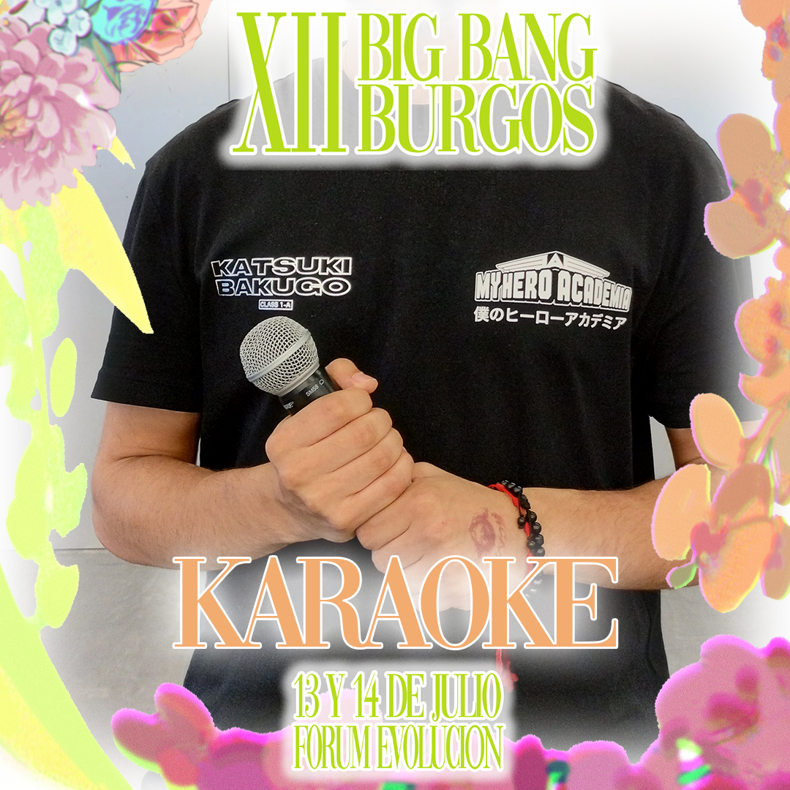
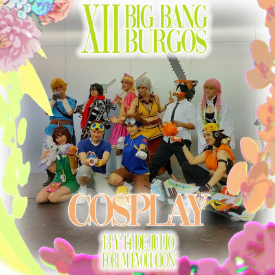



¡Volvemos una vez más a organizar Big Bang Burgos! Esta vez con inspiración en la mitología y folclore ibérico.

## Dónde y Cuándo

## 

- :calendar: Sábado y domingo, 13 y 14 de Julio de 2024
- :clock: Horario: de 10 a 14 h. y de 16:00 a 21:00 h.
- :free: Entradas 6€/dia
- 📍 [Forum Evolución](https://maps.app.goo.gl/s9eRKKqBKMyqGdMQA)
- Todos los públicos a partir de 7 años. (Es necesaria la supervisión de un adulto)

## Horarios

<a class="tag tag-red" href="https://docs.google.com/spreadsheets/d/e/2PACX-1vRK45bBjGU4LtftHjBROT5Od9L6E1RGp4-2LGK01zp4HsRmKDT6VQoCCgT79ZiDdNb7nQUe_QkLFS14/pub?output=pdf">Descarga Horario en PDF</a>

<iframe class="event-schedule" src="https://docs.google.com/spreadsheets/d/e/2PACX-1vRK45bBjGU4LtftHjBROT5Od9L6E1RGp4-2LGK01zp4HsRmKDT6VQoCCgT79ZiDdNb7nQUe_QkLFS14/pubhtml?gid=0&amp;single=true&amp;widget=true&amp;headers=false"></iframe>

<iframe class="event-schedule" src="https://docs.google.com/spreadsheets/d/e/2PACX-1vRK45bBjGU4LtftHjBROT5Od9L6E1RGp4-2LGK01zp4HsRmKDT6VQoCCgT79ZiDdNb7nQUe_QkLFS14/pubhtml?gid=1377301289&amp;single=true&amp;widget=true&amp;headers=false"></iframe> 

## Actividades

- [Escenario](#escenario)
  - [Actividades](#actividades)
  - [Concursos](#concursos)
    - [CoverDance](#cover-dance)
    - [Karaoke](#karaoke)
    - [Cosplay](#cosplay)
- [Invitados](#invitados)
- [Charlas](#charlas)
- [Talleres](#talleres)
- [Rol](#rol)
- [Juegos de mesa](#juegos-de-mesa)
  - [Patrocinadores](#patrocinadores)
  - [Torneos](#torneos)
- [Videojuegos](#videojuegos)

## Escenario

## Actividades



{}

### Pasarela cosplay

¿Tienes un cosplay que quieres enseñar a todo el mundo? ¿sabes posar como una super modelo? ¡Este es tu concurso! El sábado tendremos nuestra famosa pasarela cosplayer a la que no podéis faltar. ¡Venga! POSE, POSE, POSE, POSE

{}

{}

### Trivial K-pop

Demuestra que el kpop no es solo un tipo de música sino una manera de vivir. Junta un grupo de elegidos y demostrad que tenéis los conocimientos necesarios para ser quienes ganen nuestro trivial kpop.

{}

{}

### Trivial Friky

¿Cuánto sabes del mundo friky? Demostrad que vuestro grupo es el que más sabe de videojuegos, juegos de mesa, anime, manga, literatura, cultura japonesa y coreana... Vamos, que sois los más frikys del evento ¿Podréis hacerlo?

{}



## Concursos

### Cover Dance

En solitario, en grupo o.. ¿por qué no ambos? uno de los concursos con más afluencia y con más motivación por parte del público. Demuestra tus dotes de baile sobre el escenario ¡ADELANTE!

Inscripción:

- El concurso tendrá lugar el día 13 de Julio a las 18:30 horas.
- La inscripción se realizará en el Punto de Información desde el inicio del horario de apertura el día 13 de julio hasta media hora antes del inicio del concurso.
- Será necesario apuntar el nombre y apellidos del participante, así como un pseudónimo. En el caso de los grupos, elegir a un representante y un nombre de grupo.
- El número de plazas será acorde al tiempo disponible para la actividad, pudiendo alargarse o acortarse según lo considere oportuno la organización.

Características:

- Podrán participar tanto de forma individual como en grupo con un máximo de 10 componentes (puede hacerse alguna excepción si la organización lo
-prueba).
- Deberán aportar, un pendrive con el audio en formato MP3 cuando lo requiera la organización (por favor, aseguraos que esté libre de virus).
- También se podrán recibir entradas por correo electrónico enviando la canción a acnil@acnil.es poniendo como asunto “Concurso Cover Dance” junto con el nombre o Nick.
- Bajo ningún concepto recibiremos canciones directamente desde dispositivos móviles.
- La canción debe de durar lo mismo que la actuación. No prepararemos canciones para empezar en medio de la pista de audio o que acaben antes del final del mismo.
- Se pondrá el audio entregado sin ninguna manipulación por parte de la organización. Si el audio no es el correcto o tuviera algún defecto, no se podrá optar a repetir la actuación.
- La actuación no podrá superar los 5 minutos.
- No se permite el esparcimiento de líquidos, ni el lenguaje obsceno u ofensivo, así como también quedan prohibidos los desnudos.

Jurado y premios:

- El jurado lo compondrán 2 personas donde al menos habrá un miembro de ACNIL y un invitado a determinar. Valorarán la calidad de la actuación, la coordinación y la originalidad.
- El premio a la mejor actuación consistirá en un vale de 70€ para gastar en los stands del evento. El jurado se reserva el derecho a entregar además una mención especial valorada en 30€ para gastar en los stands del evento.

### Karaoke

Afina tus cuerdas vocales y prepárate para luchar como una idol por el primer puesto de nuestro concurso. Quizás no te lanzaremos a la fama, pero un premio en efectivo y nuestra admiración tampoco está mal...

Inscripción:

- El concurso tendrá lugar el día 14 de julio a las 16:30 horas.
- La inscripción se realizará en el Punto de Información desde el inicio del horario de apertura el día 13 de julio hasta media hora antes del inicio del concurso.
- Podrán participar de forma individual o grupal con un máximo de 6 miembros.  Los participantes deberán indicar su nombre y apellidos, así como un pseudónimo o nombre grupal y la canción que interpretarán.
- El número de plazas será acorde al tiempo disponible para la actividad, pudiendo alargarse o acortarse en función del criterio de la organización.

Características:

- No existe un límite de tiempo específico para la canción, no obstante, la organización se reserva el derecho de acortarlas en función del tiempo y el número de participantes.
- Deberán aportar un pendrive con el audio en formato MP3 cuando lo requiera la organización (por favor, aseguraos que esté libre de virus). Serán mejor valorados aquellos audios que correspondan a instrumentales, no filtros (es decir, que no se oiga la voz original por detrás).
- También se podrán recibir entradas por correo electrónico enviando la canción a acnil@acnil.es poniendo como asunto “Concurso Karaoke” junto con el nombre o Nick.
- Bajo ningún concepto recibiremos canciones directamente desde dispositivos móviles.
- La canción debe de durar lo mismo que la actuación. No prepararemos canciones para empezar en medio de la pista de audio.
- Se pondrá el audio entregado sin ninguna manipulación por parte de la organización. Si el audio no es el correcto o tuviera algún defecto, no se podrá optar a repetir la actuación.

Jurado y premios:

- El jurado lo compondrán 2 personas entre las que al menos habrá un miembro de ACNIL y un invitado especial a determinar. Las canciones en japonés o coreano recibirán mayor puntuación que en inglés o español y se valorará también la pronunciación y puesta en escena.
- El premio a la mejor actuación consistirá en un vale de 50€ para gastar en los stands del evento. El jurado se reserva el derecho a entregar además una mención especial valorada en 25€ para gastar en los stands del evento.

### Cosplay

Si no solo quieres enseñar tu cosplay, sino que quieres encarnar al personaje en cuestión... Atención porque este es tu concurso. Tanto si vienes con la actuación preparada como si no, esperamos verte en personaje todo el tiempo.

Inscripción:

- El concurso tendrá lugar el día 14 de julio a las 18:00 horas.
- La inscripción se realizará en el Punto de Información desde el inicio del horario de apertura el día 13 de julio hasta media hora antes del inicio del concurso.
- Será necesario apuntar el nombre y apellidos del participante, así como un pseudónimo. En el caso de los grupos, elegir a un representante y un nombre de grupo.
- El número de plazas será acorde al tiempo disponible para la actividad, pudiendo alargarse o acortarse según lo considere oportuno la organización.

Características:

- Podrán participar tanto de forma individual como en grupo con un máximo de 5 componentes (puede hacerse alguna excepción si la organización lo aprueba).
- Habrá dos modalidades de concurso:
  - Actuación:
    - Los cosplayers podrán llevar preparado una actuación en referencia a su personaje.
    - Deberán aportar un pendrive con el audio en formato MP3 cuando lo requiera la organización (por favor, aseguraos que esté libre de virus).
    - También se podrán recibir entradas por correo electrónico enviando la canción a acnil@acnil.es poniendo como asunto “Concurso Karaoke” junto con el nombre o Nick.
    - Bajo ningún concepto recibiremos canciones directamente desde dispositivos móviles.
    - La canción debe de durar lo mismo que la actuación. No prepararemos canciones para empezar en medio de la pista de audio.
    - Se pondrá el audio entregado sin ninguna manipulación por parte de la organización. Si el audio no es el correcto o tuviera algún defecto, no se podrá optar a repetir la actuación.
  - Batalla:
    - A los cosplayers se les entregará una situación que deberán interpretar encima del escenario como si fueran el personaje del que van caracterizados.
    - Las situaciones serán creadas por los miembros de la asociación y serán entregados al azar a cada participante unos minutos antes de que vayan a subir al escenario.
    - Los cosplayer podrán usar micrófono o no para sus situaciones.
    - De la misma forma podrán pedir ayuda a los presentadores para hacer de maniquís en la escena o pedir el uso de algún elemento sencillo de atrezzo (una silla, papeles, un bolígrafo, etc...)
- Se premiará tanto la calidad de los cosplays como la actuación en cualquiera de las dos modalidades.
- La actuación no podrá superar los 5 minutos.
- No se permite el esparcimiento de líquidos, ni el lenguaje obsceno u ofensivo, así como también quedan prohibidos los desnudos.
- Los disfraces deberán basarse en personajes de manga, anime, videojuegos, ficción o televisión. Los trajes comprados recibirán una menor puntuación por parte del jurado.
- El jurado hará una revisión de los trajes en los momentos previos a la actuación.

Jurado y Premios:

- El jurado lo compondrán 3 personas: Un miembro de ACNIL y las dos invitadas cosplayer.
- El premio al conjunto de mejor cosplay y actuación consistirá en un vale de 70€ para gastar en los stands del evento. El jurado se reserva el derecho a entregar además una mención especial valorada en 30€ para gastar en los stands del evento.

### Invitados



{}

### Clara Dies Valls (Valencia, 1996)

Ilustradora, concept artist e investigadora no académica de folklore. Licenciada en Bellas Artes por la Universitat Politécnica de Valencia en 2018, también ha realizado estudios de diseño de producción para cine en la University for the Creative Arts de Surrey y un máster en Concept Art en la Escola de Cinema de Barcelona, además de formarse en ilustración científica.
Trabaja como ilustradora desde 2010. En 2021 publica “Bestiario de Tierra y Tinta”, nominado a un Premio Ignotus a Mejor Antología. En 2023 publica “Breve Viaje por la España de las Brujas” junto a Javier Prado. En 2024, coordina, edita e ilustra la antología de cuentos de hadas queer “Salir del Camino”. Actualmente trabaja en más  proyectos que horas tiene el día.

{}

{}

### Shiroychigo

Es una cosplayer y cosmaker asturiana que lleva más de 10 años haciendo Cosplay. Ha participado en numerosos concursos y ha ganado premios tanto de pasarela como de actuación, como por ejemplo la suplencia de la preliminar española de ICL Dúo 2023 o la Mejor Cosplay de la Ultralan Valladolid 2022 o Mejor Cosmaker de la pasarela del Mangafest 2022. Además, es una gran aficionada a la fotografía, siendo su especialización el autorretrato. También es  modelo de algunas conocidas tiendas de Cosplay, para las que realiza reviews y sesiones de fotos.

{}

{}

### Shiroki

lleva más de 10 años en el mundo del cosplay. Como costurera profesional, le encanta pulir al máximo los detalles de sus trajes, añadiéndoles mimo y detalles que llaman la atención por su toque personal.

Ganadora de varios premios en distintos concursos, ha sido invitada tanto a eventos de España como internacionales. También ha trabajado para empresas de videojuegos, como Riot Games y Blizzard, eventos de eSports y otras empresas como creadora de contenido. 

{}

{}

### Sara Gómez

Es actriz de doblaje y burgalesa de adopción. En el 2018 entró por primera vez en una sala de doblaje y desde entonces no puede vivir sin la luz roja de grabación. Disfruta prestando su voz a innumerables personajes de ficción en la pequeña y gran pantalla, como son la simpática Sra. Chen de Venom; Cassandra, de La Leyenda de Vox Macchina; Jean Grey en X-Men 97; Ryan, el mismísimo hijo de Patriota en The Boys; Ost Hourai, en The Rising of Shield Hero, o Linus, de Snoopy, entre muchos otros.

{}


## Charlas

:construction: ¡Estamos afinando nuestras voces para construir esta sección! ¡Vuelve pronto para ver las actualizaciones!

## Talleres

:construction: ¡Estamos afilando nuestras herramientas para construir esta sección! ¡Vuelve pronto para ver las actualizaciones!

## Rol

:construction: ¡Estamos lanzando los dados para construir esta sección! ¡Vuelve pronto para ver las actualizaciones!

## Juegos de mesa

Como todos los años, vamos a traer con nosotros una gran parte de nuestra ludoteca para ponerla a vuestra disposición durante el evento en las mesas de juego libre. Nuestros voluntarios estarán disponibles para hacer recomendaciones de juegos y explicaros las reglas si lo necesitáis.

### Patrocinadores

Para organizar el evento, pedimos colaboración a distintas editoriales. Normalmente colaboran mandándonos juegos de forma gratuita a cambio de hacer demostraciones de estos juegos durante el evento. Como asociación **no tenemos interés económico ni favorecemos a editoriales por la simple aportación de juegos.** Sin embargo, la realidad es que nos han mandado juegos muy divertidos y estaremos encantados de demostrar.

Esta es una lista de los que más nos han gustado que podréis encontrar en el evento.


{}

### Magic Maze

Magic Maze es un juego de mesa cooperativo en tiempo real. Los jugadores deben trabajar juntos para ayudar a cuatro héroes a robar equipo mágico de un centro comercial y luego escapar antes de que se acabe el tiempo. Lo que hace que Magic Maze sea único es que los jugadores no pueden comunicarse entre sí y cada jugador puede realizar ciertas acciones, pero no todas. ¡Es un juego frenético y divertido que pone a prueba tus habilidades de cooperación y comunicación no verbal!

{}
{}

### Un Día en las Carreras

En Un Día en las Carreras, tú y tus amigos se dirigen a las carreras para pasar un día animando, abucheando y apostando a tus caballos favoritos, cuyo destino depende de cada lanzamiento de los dados.

{}
{}

### Hidden Leaders

La isla de Oshra está en tumulto. Tras la muerte del Emperador, el conflicto entre las Tribus de la Colina y el Ejército Imperial se intensificó. Mientras que el Pueblo del Agua intenta mantener el equilibrio entre los viejos rivales, los No Muertos buscan escalar la guerra. Toda esperanza recae en los seis hijos del Emperador: ¿Quién de ellos reclamará el trono?

En Hidden Leaders, asumes el papel de uno de los seis líderes secretos, cada uno de ellos aliado con dos de las cuatro facciones/colores. Al jugar héroes en tu tablero, ya sea abierta o secretamente, influyes en el resultado del conflicto.
{}

{}

### VIP RIP

VIP RIP es un juego party de celebridades y frases lapidarias. Asumirás el papel de Aurora la Enterradora, una mujer glamurosa que sólo entierra celebridades. Para ganar, enlaza refranes y dichos populares con difuntos famosos, reales o del mundo de la ficción, y consigue que el resto descubra tus asociaciones.

{}

{}

### Boomie Busters

Sabemos que no habéis podido resistiros a estas adorables criaturas, pero ¿seréis capaces de coleccionarlos a todos? Boomie Busters es un juego competitivo y familiar de cartas en el que tendréis que conseguir las colecciones de boomies más valiosas. Para ello, deberéis usar todas vuestras herramientas y emplear sabiamente vuestros kilos de viscosete.

{}

{}

### Fortisimo

Construye y organiza tu castillo colocando murallas en orden ascendente. Necesitarás una buena estrategia y un poco de memoria. ¡Un juego para toda la familia que ya ha conquistado a cientos de miles jugadores en todo el mundo!

Un juego para trabajar la memoria y la atención visual.

{}



### Torneos

Los torneos son partidas organizadas en las que el ganador se lleva... ¡Un premio!

Para apuntarte solo has de acercarte al mostrador donde prestamos los juegos de mesa y decirnos en que torneo quieres participar

Normas generales

- Se han de conocer las reglas del juego para apuntarse.
- Se ha de estar a la hora en el lugar indicado.
- Hay que respetar a los oponentes en todo momento.
- Los voluntarios de Acnil tienen la última palabra en caso de disputa.
- No nos es posible garantizar un arbitro presente durante toda la partida. Por lo que esperamos honestidad por parte de los participantes.

Al final los torneos existen para pasarlo bien y el premio es solo un incentivo para la gente que le gusta competir.


{}

### Challengers!

- :calendar: Domingo, 14 de Julio de 2024
- 📝 Inscripciones Domingo antes del torneo
- :clock: Horario: de 11:30 a 12:30 h (Puede alargarse si hay mucha gente)
- 📍 Zona de juegos de mesa
- 👤 De 4 a 16 participantes
- :warning: En caso de jugadores impares, se jugará con el robot
- ℹ️ En caso de más de 8, se jugará con el torneo de verano.

{}

{}

### Welcome hacia el perfecto hogar

- :calendar: Domingo, 14 de Julio de 2024
- 📝 Inscripciones Domingo antes del torneo
- :clock: Horario: de 12:30 a 13:30 h.
- 📍 Zona de juegos de mesa
- 👤 De 4 a 16 participantes

{}

{}

### Océanos de papel

- :calendar: Domingo, 14 de Julio de 2024
- 📝 Inscripciones Domingo antes del torneo
- :clock: Horario: de 17:00 a 18:00 h.
- 📍 Zona de juegos de mesa
- 👤 De 4 a 8 participantes

{}

{}

### Un día en las carreras

:construction:

{}



## Videojuegos

:construction: ¡Estamos pasando al siguiente nivel en la construcción de esta sección! ¡Vuelve pronto para ver las actualizaciones!

<a class="floaty-button tag tag-red" href="#actividades">Volver al indice</a>