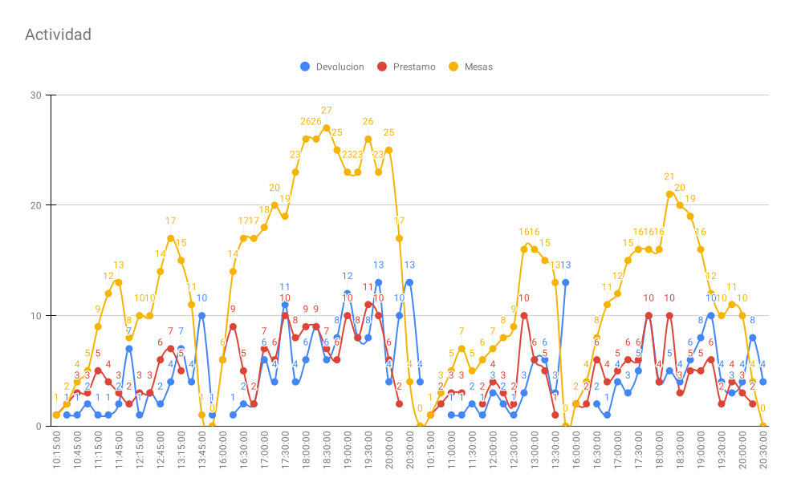

Un resumen de lo que hemos aprendido en Big Bang Burgos 2024

## Evento

Este año hemos tenido a 1000 personas en el evento a lo largo del fin de semana! Especialmente el sábado a la tarde, que sigue siendo el día con mas asistentes.

## Juegos de mesa

Este año hemos prestado un total de 305 juegos entre Sabado y Domingo! Todo un éxito :tada:

En el siguiente gráfico podemos ver que el sábado a la tarde llegamos al máximo de capacidad de **26 mesas**. El resto de dias la capacidad se ha mantenido sobre la mitad del espacio disponible.

**La linea azul** representa el número juegos que hemos prestado en el bloque de 15m y **la linea roja** representa los que nos han devuelto. Si se suman ambas lineas, al final da lugar a que hemos prestado el mismo número de juegos que nos han devuelto. **La linea amarilla** es la diferencia entre la roja y la azul, lo que nos da lugar al número de juegos que hay en mesa en un momento dado.

Entrando en que juegos han tenido mas éxito, En lo s siguientes gŕaficos vemos la cantidad de prestamos totales por juego y el tiempo que han pasado en mesa. (desde que lo hemos prestado hasta que nos lo han devuelto)

Otra vista interesante es el tiempo medio de los juegos en mesa. En este caso podemos ver que la partida de **Las Ruinas Perdidas de Arnak** duró casi 3h. :boom:. En cuanto a juegos populares, podemos ver que **de las 11 partidas de Azul, el tiempo medio fué de 50m**

También tenemos una vista de las editoriales con mas éxito dentro del evento. Podemos ver que **Devir Iberia** es la editorial de la que mas juegos se prueban en Big Bang Burgos. Ademas de que son el 16.6% de todo el tiempo de juego.

Analizando mas a fondo como se han realizado los prestamos, hemos podido entender que hay dos factores importantes que determinan lo que estamos viendo.

- Atractivo visual de los juegos.
- Conocimiento del catalogo de juegos por parte de los voluntarios.

Juegos como Virus, Exploding Kittens o VIP RIP suelen captar la atención de la gente, y a menudo nos los piden directamente. Por eso, el atractivo visual y temático de los juegos es un factor clave a la hora de decidir si los prestamos durante el evento o no.

Sin embargo, la mayoría de las personas no están familiarizadas con los juegos de nuestra ludoteca, y lo que eligen probar suele depender de las recomendaciones de los voluntarios. Esto significa que los juegos prestados en un evento varían mucho según el conocimiento y la afinidad que los voluntarios tengan por ciertos juegos. Un ejemplo claro es Hanamikoji, un juego que nos encantó cuando lo probamos y que recomendamos ampliamente a casi todos los que buscaban un juego para dos jugadores. Otro ejemplo es Strike!, que también es uno de nuestros favoritos y suele estar entre las recomendaciones.

